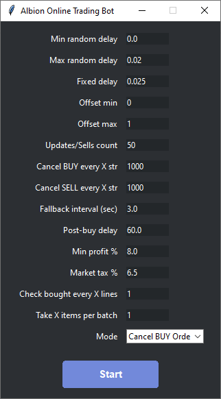

# Albion Online Trading Bot

This is a ready-made trading bot for Albion Online that automates in-game trading.  
The user launches the application, configures the settings, and starts the bot.

The bot supports multiple operation modes, including updating buy/sell orders, buying items, selling items, cancelling orders, and 24/7 continuous operation.

  

  <h2 style="margin-top:0;">Configuration Parameters</h2>

  

    <h3 style="margin:0 0 8px 0;">min_random_delay — Minimum Random Delay</h3>
    
<b>Type:</b> float (seconds) 
       <b>Default:</b> 0.5

    
<b>Description:</b> 
       Minimum delay between bot actions. The bot randomly selects a delay value between <b>min_random_delay</b> and <b>max_random_delay</b>.

    
<b>Purpose:</b> 
       Adds randomness to bot behavior so it looks more natural.

  

  

    <h3 style="margin:0 0 8px 0;">max_random_delay — Maximum Random Delay</h3>
    
<b>Type:</b> float (seconds) 
       <b>Default:</b> 2.0

    
<b>Description:</b> 
       Maximum delay between bot actions. The bot randomly selects a delay value between <b>min_random_delay</b> and <b>max_random_delay</b>.

    
<b>Purpose:</b> 
       Prevents the bot from waiting too long.

  

  

    <h3 style="margin:0 0 8px 0;">fixed_delay — Fixed Delay</h3>
    
<b>Type:</b> float (seconds) 
       <b>Default:</b> 0.1

    
<b>Description:</b> 
       A constant delay added between actions regardless of random delay.

    
<b>Purpose:</b> 
       Ensures a stable base delay for all actions.

  

  

    <h3 style="margin:0 0 8px 0;">offset_min — Minimum Mouse Offset</h3>
    
<b>Type:</b> int (pixels) 
       <b>Default:</b> 1

    
<b>Description:</b> 
       Minimum random mouse cursor offset for clicks.

    
<b>Purpose:</b> 
       Makes clicks look more human by shifting cursor slightly.

  

  

    <h3 style="margin:0 0 8px 0;">offset_max — Maximum Mouse Offset</h3>
    
<b>Type:</b> int (pixels) 
       <b>Default:</b> 5

    
<b>Description:</b> 
       Maximum random mouse cursor offset for clicks.

    
<b>Purpose:</b> 
       Limits the maximum shift for cursor movement.

  

  

    <h3 style="margin:0 0 8px 0;">mode — Operation Mode</h3>
    
<b>Type:</b> string 
       <b>Default:</b> Update Buy Orders

    
<b>Description:</b> 
       Bot operation mode. Choose from the available modes in the UI.

    
<b>Purpose:</b> 
       Defines what actions the bot will perform.

  

  

    <h3 style="margin:0 0 8px 0;">action_count — Actions Count</h3>
    
<b>Type:</b> int 
       <b>Default:</b> 1

    
<b>Description:</b> 
       Number of update/sell actions the bot performs per cycle.

    
<b>Purpose:</b> 
       Controls how many items/orders are processed each loop.

  

  

    <h3 style="margin:0 0 8px 0;">cancel_buy_every — Cancel BUY Every X Lines</h3>
    
<b>Type:</b> int 
       <b>Default:</b> 1000

    
<b>Description:</b> 
       Cancels BUY orders every specified number of lines in the list.

    
<b>Purpose:</b> 
       Periodically clears outdated buy orders.

  

  

    <h3 style="margin:0 0 8px 0;">cancel_sell_every — Cancel SELL Every X Lines</h3>
    
<b>Type:</b> int 
       <b>Default:</b> 1000

    
<b>Description:</b> 
       Cancels SELL orders every specified number of lines in the list.

    
<b>Purpose:</b> 
       Periodically clears outdated sell orders.

  

  

    <h3 style="margin:0 0 8px 0;">post_buy_delay — Post-Buy Delay</h3>
    
<b>Type:</b> float (seconds) 
       <b>Default:</b> 1.0

    
<b>Description:</b> 
       Delay after purchasing an item.

    
<b>Purpose:</b> 
       Allows time for the game to process the purchase.

  

  

    <h3 style="margin:0 0 8px 0;">min_profit_pct — Minimum Profit Percentage</h3>
    
<b>Type:</b> float (%) 
       <b>Default:</b> 8.0

    
<b>Description:</b> 
       Minimum required profit percentage for a trade to be executed.

    
<b>Purpose:</b> 
       Prevents low-profit trades.

  

  

    <h3 style="margin:0 0 8px 0;">tax_pct — Market Tax Percentage</h3>
    
<b>Type:</b> float (%) 
       <b>Default:</b> 6.5

    
<b>Description:</b> 
       Market tax percentage used in profit calculation.

    
<b>Purpose:</b> 
       Ensures profit is calculated correctly after taxes.

  

  

    <h3 style="margin:0 0 8px 0;">check_every_lines — Check Bought Every X Lines</h3>
    
<b>Type:</b> int 
       <b>Default:</b> 1

    
<b>Description:</b> 
       Checks bought items every specified number of lines.

    
<b>Purpose:</b> 
       Periodic verification to prevent errors or missed items.

  

  

    <h3 style="margin:0 0 8px 0;">take_items_batch — Take Items Per Batch</h3>
    
<b>Type:</b> int 
       <b>Default:</b> 1

    
<b>Description:</b> 
       Number of items the bot collects in one cycle.

    
<b>Purpose:</b> 
       Controls batch size for item collection.

  

  

    <h3 style="margin:0 0 8px 0;">fallback_interval — Fallback Interval</h3>
    
<b>Type:</b> float (seconds) 
       <b>Default:</b> 3.0

    
<b>Description:</b> 
       Delay time when an error or fallback situation occurs.

    
<b>Purpose:</b> 
       Gives the bot time to recover from issues or unstable states.

  

