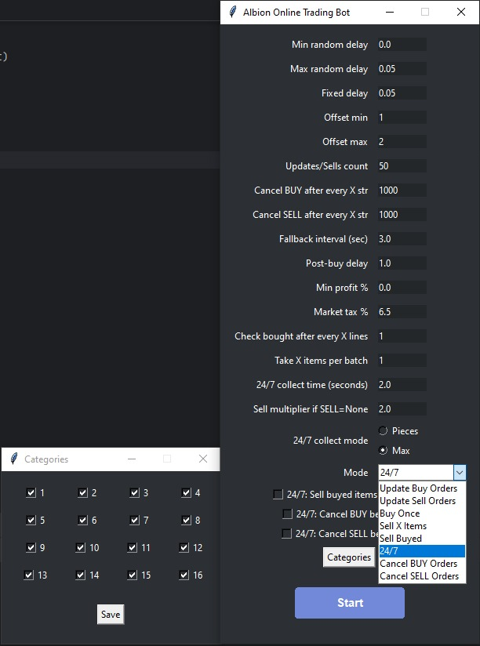

<h2>📦 Item Format</h2>

Each item in the items list must follow this format:

<pre style="background:#f7f7f7; padding:10px; border-radius:6px; border:1px solid #ccc;">
item tier.enchant [cat:category][amount][qua:quality]
</pre>

<h3>Field description</h3>
<ul>
  <li><b>item</b> — item name (string)</li>
  <li><b>tier</b> — item tier (e.g. 4, 5, 6)</li>
  <li><b>enchant</b> — enchantment level (0–4)</li>
  <li><b>cat:category</b> <i>(optional)</i> — market category (1 - 16)</li>
  <li><b>amount</b> <i>(optional)</i> — amount to buy</li>
  <li><b>qua:quality</b> <i>(optional)</i> — item quality (normal, good, outstanding, excellent, masterpiece)</li>
</ul>

<h3>Examples</h3>
<pre style="background:#f7f7f7; padding:10px; border-radius:6px; border:1px solid #ccc;">
Adept's bag 4.0 [cat:Bags][subcat:4][10][qua:normal]
Sword 6.1 [100]
cape 5.2 [qua:excellent][cat:3][cat:cApe][10]
</pre>

  <h3 style="margin:0 0 10px 0;">Notes</h3>

  <ul>
    <li><b>Letter case does not matter</b> — item names, categories, and subcategories are <b>case-insensitive</b>.</li>
    <li><b>Additional arguments order does not matter</b> — optional parameters
        (<code>cat</code>, <code>subcat</code>, <code>amount</code>, <code>qua</code>)
        can be placed in <b>any order</b>.</li>
    <li><b>Tier normalization</b> — the following values are treated as the same:
      <ul>
        <li><code>4</code> = <code>4.0</code></li>
        <li><code>4.</code> = <code>4.0</code></li>
        <li><code>4.1</code> = <code>4.0</code></li>
      </ul>
    </li>
  </ul>

## 🔘 Navigation

  
  
  

# Albion Online Trading Bot

This is a ready-made trading bot for Albion Online that automates in-game trading.  
The user launches the application, configures the settings, and starts the bot.

The bot supports multiple operation modes, including updating buy/sell orders, buying items, selling items, cancelling orders, and 24/7 continuous operation.

<h2>Bot Settings</h2>

  <h3 style="margin:0 0 10px 0;">min_random_delay</h3>
  
<b>Type:</b> float

  
<b>Default:</b> 0.5

  
<b>What it does:</b> 
     This is the minimum value for the random delay between bot actions.
     The bot chooses a random delay between <b>min_random_delay</b> and <b>max_random_delay</b> for each action.
     If <b>min_random_delay</b> is set too low, the bot may act too fast and look unnatural.
     If it is higher, the bot will behave more slowly and naturally.

  
<b>Interaction:</b> 
     Works together with <b>max_random_delay</b>. If <b>min_random_delay</b> is greater than <b>max_random_delay</b>, the random delay range becomes invalid.

  <h3 style="margin:0 0 10px 0;">max_random_delay</h3>
  
<b>Type:</b> float

  
<b>Default:</b> 2.0

  
<b>What it does:</b> 
     This is the maximum value for the random delay between bot actions.
     The bot chooses a random delay between <b>min_random_delay</b> and <b>max_random_delay</b> for each action.
     If <b>max_random_delay</b> is too high, the bot will slow down significantly.
     If it is too low, the bot may be detected as robotic due to too fast actions.

  
<b>Interaction:</b> 
     Works together with <b>min_random_delay</b>. The effective delay is always between these two values.

  <h3 style="margin:0 0 10px 0;">fixed_delay</h3>
  
<b>Type:</b> float

  
<b>Default:</b> 0.1

  
<b>What it does:</b> 
     Fixed delay added to every action regardless of random delay.

  
<b>Interaction:</b> 
     Total delay is <b>random_delay + fixed_delay</b>. If <b>fixed_delay</b> is high, the bot will always be slow.

  <h3 style="margin:0 0 10px 0;">offset_min</h3>
  
<b>Type:</b> int

  
<b>Default:</b> 1

  
<b>What it does:</b> 
     Minimum offset for mouse movement randomization.

  
<b>Interaction:</b> 
     Works together with <b>offset_max</b>. If <b>offset_min</b> is greater than <b>offset_max</b>, the offset range becomes invalid.

  <h3 style="margin:0 0 10px 0;">offset_max</h3>
  
<b>Type:</b> int

  
<b>Default:</b> 5

  
<b>What it does:</b> 
     Maximum offset for mouse movement randomization.

  
<b>Interaction:</b> 
     Works together with <b>offset_min</b>. The actual offset is chosen randomly between these values.

  <h3 style="margin:0 0 10px 0;">mode</h3>
  
<b>Type:</b> string

  
<b>Default:</b> Update Buy Orders

  
<b>What it does:</b> 
     Sets the main operation mode of the bot.

  
<b>Possible values:</b> 
     Update Buy Orders, Update Sell Orders, Buy Once, Sell X Items, 24/7, Cancel BUY Orders, Cancel SELL Orders

  
<b>Interaction:</b> 
     Other settings such as <b>action_count</b>, <b>cancel_buy_every</b>, <b>cancel_sell_every</b>, <b>take_items_batch</b> are used differently depending on the selected mode.

  <h3 style="margin:0 0 10px 0;">action_count</h3>
  
<b>Type:</b> int

  
<b>Default:</b> 1

  
<b>What it does:</b> 
     Number of items/orders the bot processes per cycle.

  
<b>Interaction:</b> 
     In Update modes, it defines how many rows/orders will be updated each iteration. In other modes it may be ignored or used differently.

  <h3 style="margin:0 0 10px 0;">cancel_buy_every</h3>
  
<b>Type:</b> int

  
<b>Default:</b> 1000

  
<b>What it does:</b> 
     Number of processed lines/orders after which the bot cancels buy orders.

  
<b>Interaction:</b> 
     Works with <b>action_count</b> and <b>mode</b>. In modes involving buy orders, cancellation occurs every X processed items.

  <h3 style="margin:0 0 10px 0;">cancel_sell_every</h3>
  
<b>Type:</b> int

  
<b>Default:</b> 1000

  
<b>What it does:</b> 
     Number of processed lines/orders after which the bot cancels sell orders.

  
<b>Interaction:</b> 
     Works with <b>action_count</b> and <b>mode</b>. In modes involving sell orders, cancellation occurs every X processed items.

  <h3 style="margin:0 0 10px 0;">post_buy_delay</h3>
  
<b>Type:</b> float

  
<b>Default:</b> 1.0

  
<b>What it does:</b> 
     Delay after buying an item to wait for the market UI to update and confirm the purchase.

  
<b>Interaction:</b> 
     Combined with random and fixed delays: <b>post_buy_delay + random_delay + fixed_delay</b>.

  <h3 style="margin:0 0 10px 0;">min_profit_pct</h3>
  
<b>Type:</b> float

  
<b>Default:</b> 8.0

  
<b>What it does:</b> 
     Minimum profit percentage required for placing sell orders.

  
<b>Interaction:</b> 
     Works with <b>tax_pct</b>. Profit is calculated after tax. If <b>min_profit_pct</b> is too high, no sell orders may be placed.

  <h3 style="margin:0 0 10px 0;">tax_pct</h3>
  
<b>Type:</b> float

  
<b>Default:</b> 6.5

  
<b>What it does:</b> 
     Market tax percentage used for profit calculation.

  
<b>Interaction:</b> 
     Works with <b>min_profit_pct</b>. Higher tax reduces profit, so <b>min_profit_pct</b> may need to be increased.

  <h3 style="margin:0 0 10px 0;">check_every_lines</h3>
  
<b>Type:</b> int

  
<b>Default:</b> 1

  
<b>What it does:</b> 
     Defines how often the bot checks bought items.  
     If set to 1, it checks every line. If set to 5, it checks every 5 lines.

  
<b>Interaction:</b> 
     Works with <b>take_items_batch</b>. If set too high, the bot may miss bought items.

  <h3 style="margin:0 0 10px 0;">take_items_batch</h3>
  
<b>Type:</b> int

  
<b>Default:</b> 1

  
<b>What it does:</b> 
     Number of items the bot takes from the market per batch.

  
<b>Interaction:</b> 
     Works with <b>check_every_lines</b>. If set high, bot collects more items per operation and may need more delay.

  <h3 style="margin:0 0 10px 0;">fallback_interval</h3>
  
<b>Type:</b> float

  
<b>Default:</b> 3.0

  
<b>What it does:</b> 
     Delay used when the bot cannot find UI elements or fails to perform an action.  
     The bot waits this time before retrying.

  
<b>Interaction:</b> 
     Works with random and fixed delays. If UI is unstable, increasing this value can reduce errors.

  <h3 style="margin:0 0 10px 0;">collect_mode</h3>
  
<b>Type:</b> string

  
<b>Default:</b> single

  
<b>What it does:</b> 
     Defines how sell orders are placed by the bot.

  
<b>Possible values:</b> 
     <b>single</b> — collect pieces for sale. 
     <b>bulk</b> — collect all items in one operation for sale.

  
<b>Interaction:</b> 
     Used in sell-related modes such as <b>Sell X Items</b>, <b>Update Sell Orders</b>, and <b>24/7</b>.
     May affect required delays and click count during selling operations.

  <h3 style="margin:0 0 10px 0;">sell_multiplier_if_none</h3>
  
<b>Type:</b> float

  
<b>Default:</b> 2.0

  
<b>What it does:</b> 
     Multiplier applied to the market price when placing a sell order if no current orders exist for the item.  
     For example, if the market has no existing sell orders, the bot will list the item at <b>market_price × sell_multiplier_if_none</b>.

  
<b>Interaction:</b> 
     Used only for sell operations in <b>24/7</b> mode.  
     Ignored in all other modes, including buy operations, manual sales, Sell Once, or Update Sell Orders.  
     Does not affect buying or cancelling orders.

  <h3 style="margin:0 0 10px 0;">collect_time</h3>
  
<b>Type:</b> float

  
<b>Default:</b> 2.0

  
<b>What it does:</b> 
     Time in seconds the bot waits while collecting items from the market or inventory during a collection operation.  
     Ensures all items are properly gathered before moving to the next action.

  
<b>Interaction:</b> 
     Works together with <b>collect_mode</b> and <b>take_items_batch</b>.  
     If set too low, the bot may miss items; if set too high, operations become slower than necessary.

<h2>Game Settings</h2>

  <h3 style="margin:0 0 10px 0;">Language</h3>
  
<b>Requirement:</b> English

  <h3 style="margin:0 0 10px 0;">Resolution</h3>
  
<b>Requirement:</b> 1920x1080

  <h3 style="margin:0 0 10px 0;">Window Mode</h3>
  
<b>Requirement:</b> Windowed

  <h3 style="margin:0 0 10px 0;">HUD Scale</h3>
  
<b>Requirement:</b> 70%

  <h3 style="margin:0 0 10px 0;">Window Scale</h3>
  
<b>Requirement:</b> 80%

  <h3 style="margin:0 0 10px 0;">Animations</h3>
  
<b>Recommended:</b> Disabled

  
<b>Reason:</b> Animations can slow down the bot and cause incorrect element detection.

<h2>How to Run the Bot</h2>

  <ol>
    <li>Download all files from GitHub (download the <b>.exe</b> manually, because GitHub does not include it in the ZIP archive).</li>
    <li>Run the bot once.</li>
    <li>Move all files from the created folder to: 
        <b>C:\Users\DALREX\Desktop\Erteriox\AlbionOnline\Trading</b></li>
    <li>Before starting the bot, make sure to select the <b>English input language</b>.</li>
    <li>Run the bot again.</li>
    <li>Configure the settings according to the instructions above.</li>
    <li>Click <b>Start</b>.</li>
    <li>Enjoy.</li>
  </ol>

<h2 id="logs">Logs</h2>

  <h3 style="margin:0 0 10px 0;">Automatic Folder and File Creation</h3>
  
The bot automatically creates the required folder and files on the first run.

  
<b>Path:</b> 
     <code>C:\Users\DALREX\Desktop\Erteriox\AlbionOnline\Trading</code>

  
If the folder does not exist, it will be created automatically after first run.

  <h3 style="margin:0 0 10px 0;">log.txt</h3>
  
All major errors and warnings are recorded in <b>log.txt</b>.  
     Approximately 90% of common issues are logged here, including:

  <ul>
    <li>Missing files (config, items list, etc.)</li>
    <li>Incorrect file paths</li>
    <li>Missing permissions</li>
    <li>Bot UI element not found</li>
    <li>Network errors (if used)</li>
    <li>Unexpected internal errors</li>
    <li>Tesseract is not installed or not detected</li>
  </ul>
  
If the bot stops working or behaves incorrectly, check <b>log.txt</b> first.

